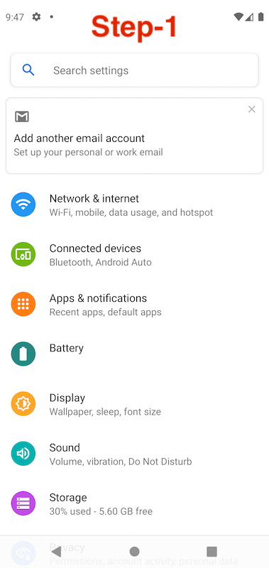
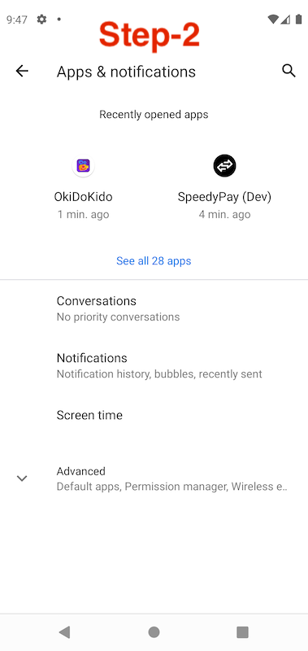
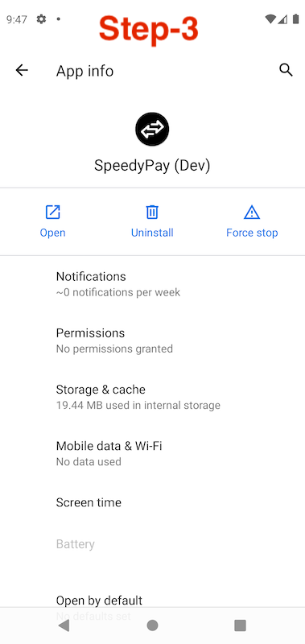
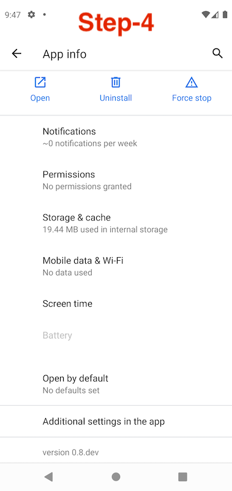
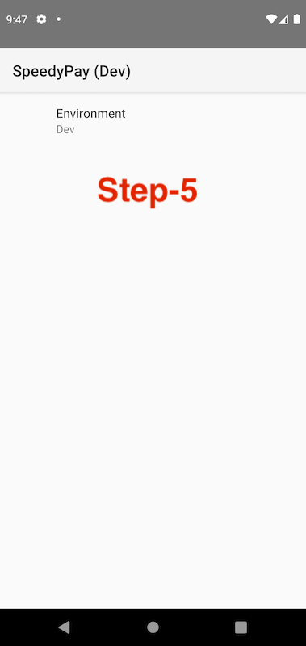
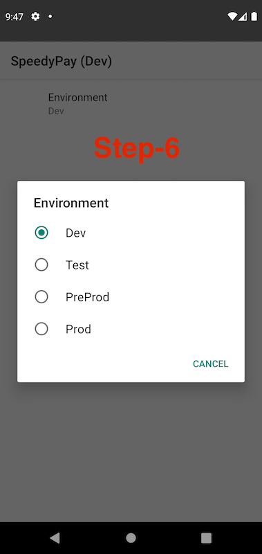
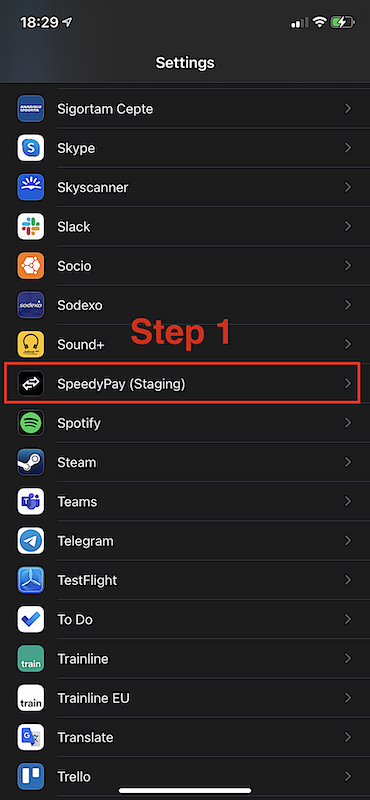

## Structure

## Environmental Tests on Mobile Apps

### Changing Environment on Android
* Preference Scene to update preferences persistently.
    * Preference Scene can be accessible at Settings (phone) --> Apps and notifications --> SpeedyPay --> Advanced --> Additional settings in the app.

    * Steps:
    
        
        
        
        
        
        
        

    * Preference Scene can be accessible when the app is installed via AppCenter for Alpha or Beta versions.
    * When the environment changes, the application will restart with the new environment.
* Updated SharedPreferences File with the environment.
    * If the file of the SharedPreferences includes token information, the application will open Home Scene otherwise the application will open Intro Scene when the environment changes.

### Changing Environment on iOS
* Sing out and close the app.
* Settings Scene to update preferences persistently.
    * Settings Scene can be accessible at Settings (phone) --> Scroll down and find the app --> SpeedyPay --> Environment --> Select one of the environments that are tested.

    * Steps:

        
        
        

    * Settings Scene can be accessible when the app is installed via AppCenter for Alpha or Beta versions.
    * When the environment changes, the application won't restart with the new environment.

### Troubleshooting for iOS
*  If you don't sing out from the app, tokens may not be changed and the app can raise network errors. For a clean test, please firstly sign out and close the app. Later, change the environment.